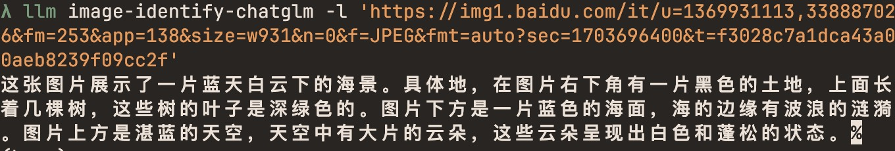

# llm-zhipu

[](https://pypi.org/project/llm-zhipu/)
[](https://github.com/noahlias/llm-zhipu/releases)
[](https://github.com/noahlias/llm-zhipu/actions/workflows/test.yml)
[](https://github.com/noahlias/llm-zhipu/blob/main/LICENSE)

ChatGLM(_智浦清言_)


## Installation

Install this plugin in the same environment as [LLM](https://llm.datasette.io/).
```bash
llm install llm-zhipu
```
## Usage

Usage instructions go here.


```
llm image-identify-chatglm -l 'https://img1.baidu.com/it/u=1369931113,3388870256&fm=253&app=138&size=w931&n=0&f=JPEG&fmt=auto?sec=1703696400&t=f3028c7a1dca43a080aeb8239f09cc2f'
```



## Development

To set up this plugin locally, first checkout the code. Then create a new virtual environment:
```bash
cd llm-zhipu
python3 -m venv venv
source venv/bin/activate
```
Now install the dependencies and test dependencies:
```bash
llm install -e '.[test]'
```
To run the tests:
```bash
pytest
```
